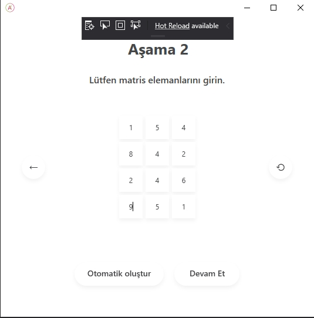
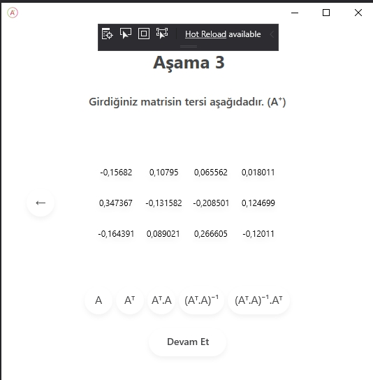

## PINV
 

### What's Bookmark?

Pinv is a desktop application which uses a given **n x m** dimensional matrix to get a pseudoinverse of that given matrix step by step with Moore-Penrose Approach.

### Pros

- Friendly UI
- Easy Understanding
- Flex Dimensional
- Uses Moore-Penrose

### Step1 : Create A Matrix

### Step1 : Fill The Created Matrix

### Step1 : Unveil The Matrix's Steps

### Authors

 - [Oguzhan Turker](https://github.com/oguzturker8/)
 - [Ata Gulalan](https://github.com/atagulalan/)
